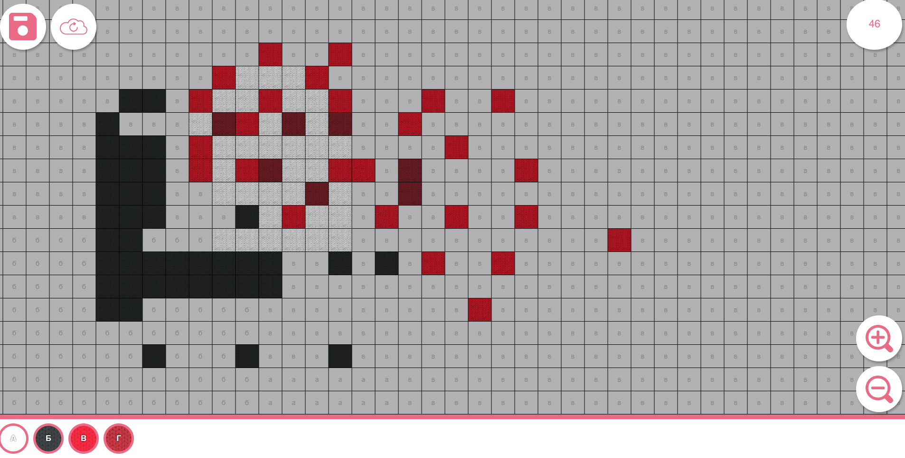

# game
Прототип игры Вышивание крестиком на pixi.js

# Дизайн
- Разместил в figma [тут](https://www.figma.com/file/2B4QgprQddQGqtW48sSlmp/Embroidery?node-id=0%3A1)

# Запуск на своём устройстве
Для запуска вам необходимо ввести следующие команды в командной строке прямо в папке с игрой:
```
npm install
npm i http-server
http-server
```
> 

